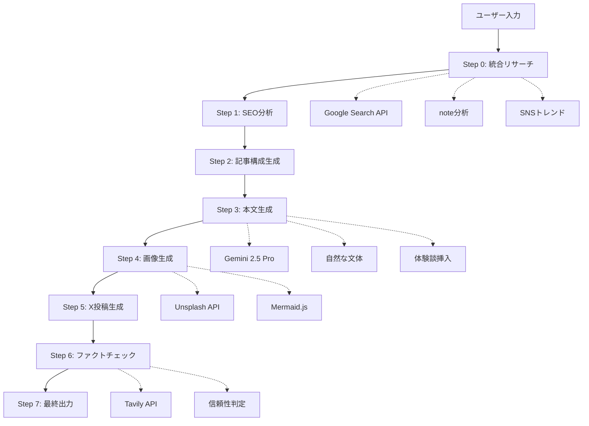
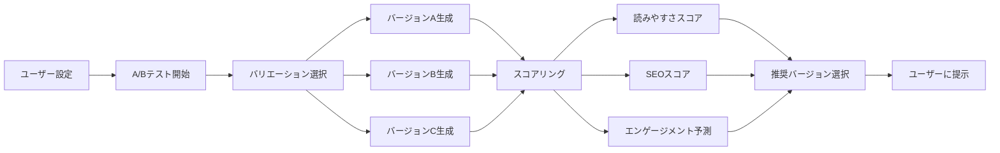

# 🏗️ Note Agent AI - アーキテクチャドキュメント

**バージョン**: 1.5.0  
**最終更新**: 2025年10月15日

---

## 📋 目次

1. [概要](#概要)
2. [システムアーキテクチャ](#システムアーキテクチャ)
3. [技術スタック](#技術スタック)
4. [データフロー](#データフロー)
5. [コンポーネント設計](#コンポーネント設計)
6. [サービス層](#サービス層)
7. [状態管理](#状態管理)
8. [API統合](#api統合)
9. [セキュリティ](#セキュリティ)
10. [パフォーマンス最適化](#パフォーマンス最適化)

---

## 🎯 概要

Note Agent AIは、AIを活用してnote記事を自動生成する統合プラットフォームです。React + Next.js + TypeScriptをベースに、マイクロサービス的なアーキテクチャを採用し、高い拡張性と保守性を実現しています。

### アーキテクチャの特徴

- **モジュラー設計**: 機能ごとに独立したサービス層
- **レイヤードアーキテクチャ**: プレゼンテーション→ビジネスロジック→データの明確な分離
- **マルチモーダル統合**: テキスト・画像・音声の統合処理
- **スケーラブル**: フェーズごとに段階的に機能追加可能

---

## 🏛️ システムアーキテクチャ

### 全体構成図

```
┌─────────────────────────────────────────────────────────────────┐
│                         User Interface Layer                     │
│  ┌──────────────────────────────────────────────────────────┐  │
│  │   Next.js 15 (App Router) + React 19 + TypeScript 5.8   │  │
│  │   - Forms (入力UI)                                         │  │
│  │   - Display (結果表示)                                     │  │
│  │   - Feedback (進捗表示)                                    │  │
│  │   - Theme (ダークモード)                                   │  │
│  │   - Preview (リアルタイムプレビュー)                        │  │
│  └──────────────────────────────────────────────────────────┘  │
└─────────────────────────────────────────────────────────────────┘
                                 ↓
┌─────────────────────────────────────────────────────────────────┐
│                      Application Logic Layer                     │
│  ┌──────────────────────────────────────────────────────────┐  │
│  │   Services (ビジネスロジック)                              │  │
│  │   - AI Service (Gemini AI統合)                            │  │
│  │   - Research Service (統合リサーチ)                        │  │
│  │   - Social Service (SNS展開)                              │  │
│  │   - SEO Service (SEOキーワード生成)                        │  │
│  │   - A/B Test Service (複数バージョン生成)                  │  │
│  │   - Audio Service (音声認識)                              │  │
│  │   - Automation Service (Playwright)                       │  │
│  └──────────────────────────────────────────────────────────┘  │
└─────────────────────────────────────────────────────────────────┘
                                 ↓
┌─────────────────────────────────────────────────────────────────┐
│                      External Integration Layer                  │
│  ┌────────────┬────────────┬────────────┬────────────────────┐ │
│  │ Gemini AI  │ Tavily API │ Supabase   │ Playwright         │ │
│  │ (生成AI)    │ (ファクト)   │ (Auth/DB)  │ (ブラウザ自動化)     │ │
│  └────────────┴────────────┴────────────┴────────────────────┘ │
│  ┌────────────┬────────────┬────────────┬────────────────────┐ │
│  │ Google     │ YouTube    │ Unsplash   │ Mermaid.js         │ │
│  │ Search API │ Data API   │ API        │ (図解生成)           │ │
│  └────────────┴────────────┴────────────┴────────────────────┘ │
└─────────────────────────────────────────────────────────────────┘
                                 ↓
┌─────────────────────────────────────────────────────────────────┐
│                          Data Layer                              │
│  ┌────────────────────┬───────────────────────────────────────┐ │
│  │ LocalStorage       │ Supabase PostgreSQL                   │ │
│  │ - 下書き保存        │ - ユーザー認証データ                    │ │
│  │ - テーマ設定        │ - 記事履歴                             │ │
│  │ - ユーザー設定      │ - メモリデータ (Phase 2)                │ │
│  └────────────────────┴───────────────────────────────────────┘ │
└─────────────────────────────────────────────────────────────────┘
```

---

## 🛠️ 技術スタック

### フロントエンド

```typescript
{
  "framework": "Next.js 15.1.0 (App Router)",
  "library": "React 19",
  "language": "TypeScript 5.8",
  "styling": "Tailwind CSS 3.4 + PostCSS",
  "markdown": "react-markdown 10.1.0 + remark-gfm + rehype-*",
  "diagram": "mermaid 11.12.0",
  "state": "React Hooks + Context API"
}
```

### AI / ML

```typescript
{
  "primary": "Google Gemini 2.5 Flash/Pro",
  "factCheck": "Tavily API",
  "speech": "Web Speech API + Gemini Audio",
  "future": "LangChain (RAG統合 - Phase 2)"
}
```

### バックエンド・データベース

```typescript
{
  "auth": "Supabase Auth",
  "database": "Supabase PostgreSQL + Pgvector (Phase 2)",
  "storage": "LocalStorage (Phase 1-1.5), Supabase Storage (Phase 2+)",
  "realtime": "Supabase Realtime (Phase 2.5)"
}
```

### ブラウザ自動化

```typescript
{
  "automation": "Playwright 1.56",
  "target": "note.com, WordPress (Phase 3)"
}
```

---

## 🔄 データフロー

### 記事生成フロー（8ステップ）



### A/Bテストフロー



---

## 🧩 コンポーネント設計

### コンポーネント階層

```
App.tsx (ルートコンポーネント)
├── ThemeProvider (テーマ管理)
│   ├── Header
│   │   ├── Logo
│   │   ├── ThemeToggle
│   │   ├── VoiceInputButton
│   │   └── ABTestButton
│   │
│   ├── InputSection
│   │   ├── InputGroup (フォーム)
│   │   ├── ModelSelector
│   │   └── SubmitButton
│   │
│   ├── ProgressSection
│   │   └── StepIndicator (8段階表示)
│   │
│   ├── OutputSection
│   │   ├── OutputDisplay
│   │   │   ├── NoteStylePreview
│   │   │   ├── MarkdownView
│   │   │   ├── XPostDisplay
│   │   │   ├── FactCheckDisplay
│   │   │   ├── SEOKeywordDisplay
│   │   │   └── DiagramDisplay
│   │   │
│   │   ├── ABTestResultDisplay
│   │   │   ├── ABTestVersionCard (×N)
│   │   │   └── ABTestComparisonView
│   │   │
│   │   └── DraftSaveButton
│   │
│   └── SidePanel (Phase 2+)
│       ├── HistoryPanel
│       ├── DraftList
│       └── CollaborationSidebar
```

### 主要コンポーネントの責務

| コンポーネント | 責務 | 状態管理 |
|-------------|------|---------|
| `App.tsx` | アプリケーション全体のオーケストレーション | `useState`, `useRef` |
| `InputGroup` | ユーザー入力の収集 | Form State |
| `StepIndicator` | 進捗状況の可視化 | Props経由 |
| `OutputDisplay` | 生成結果の表示 | Props経由 |
| `NoteStylePreview` | note風プレビュー | Markdown解析 |
| `ABTestPanel` | A/Bテスト設定 | Local State |
| `VoiceIdeaProcessor` | 音声入力処理 | Local State + AI |
| `ThemeToggle` | テーマ切り替え | Context API |

---

## 🎯 サービス層

### サービス設計原則

1. **単一責任の原則**: 各サービスは1つの責務のみ
2. **依存性注入**: サービス間の疎結合
3. **エラーハンドリング**: 統一されたエラー処理
4. **リトライロジック**: API障害時の自動再試行

### 主要サービス

#### 1. AI Service (`geminiService.ts`)

**責務**: Gemini AIとの統合

```typescript
// 主要メソッド
export async function analyzeSearchResults(keyword: string): Promise<AnalysisResult>
export async function createArticleOutline(analysis: AnalysisResult, formData: FormData): Promise<ArticleOutline>
export async function writeArticle(outline: ArticleOutline, formData: FormData): Promise<string>
export async function generateImage(theme: string): Promise<string>
```

**特徴**:
- 指数バックオフによるリトライ
- レート制限への対応
- フォールバック戦略（画像生成失敗時）

#### 2. Research Service (`searchService.ts`, `tavilyService.ts`)

**責務**: 統合リサーチ・ファクトチェック

```typescript
// 統合リサーチ
export async function performIntegratedResearch(keyword: string): Promise<ResearchResult>

// ファクトチェック
export async function extractClaims(content: string): Promise<string[]>
export async function performFactCheck(claims: string[]): Promise<FactCheckSummary>
```

#### 3. Social Service (`xPostGenerator.ts`)

**責務**: SNS投稿文生成

```typescript
export async function generateXPosts(
  articleContent: string,
  title: string,
  options: XPostGenerationOptions
): Promise<XPostGenerationResult>
```

#### 4. A/B Test Service (`abtestService.ts`)

**責務**: 複数バージョン生成・比較

```typescript
export async function runABTest(
  request: ABTestRequest
): Promise<ABTestResult>

export function selectRecommendedVersion(
  versions: ABTestVersion[]
): ABTestVersion
```

#### 5. Audio Service (`speechRecognitionService.ts`)

**責務**: 音声認識・アイデア分析

```typescript
export class SpeechRecognitionService {
  startRecording(): Promise<void>
  stopRecording(): Promise<SpeechRecognitionResult>
  processVoiceIdea(transcript: string): Promise<VoiceIdeaResult>
}
```

#### 6. Automation Service (`noteService.ts`)

**責務**: ブラウザ自動操作

```typescript
export class NoteAutoPostService {
  async initialize(config: NotePostConfig): Promise<void>
  async postArticle(data: NotePostData): Promise<string>
  async cleanup(): Promise<void>
}
```

---

## 📦 状態管理

### 状態管理戦略

```typescript
// 1. ローカル状態（useState）
const [formData, setFormData] = useState<FormData>(initialFormData);
const [currentStep, setCurrentStep] = useState<ProcessStep>(ProcessStep.IDLE);

// 2. グローバル状態（Context API）
const { theme, toggleTheme } = useTheme(); // ThemeContext

// 3. サーバー状態（Supabase + React Query - Phase 2）
const { data: articles, isLoading } = useArticleHistory();

// 4. 永続化状態（LocalStorage）
const [drafts, setDrafts] = useLocalStorage<Draft[]>('drafts', []);
```

### Context Providers

```typescript
// ThemeContext - ダークモード管理
export const ThemeProvider: React.FC<{ children: React.ReactNode }> = ({ children }) => {
  const [theme, setTheme] = useState<Theme>(() => {
    // LocalStorageから初期値を読み込み
    return (localStorage.getItem('theme') as Theme) || Theme.SYSTEM;
  });
  // ...
};

// AuthContext - 認証管理 (Phase 2)
export const AuthProvider: React.FC<{ children: React.ReactNode }> = ({ children }) => {
  const [user, setUser] = useState<User | null>(null);
  const [session, setSession] = useState<Session | null>(null);
  // ...
};
```

---

## 🔌 API統合

### API統合アーキテクチャ

```typescript
// 環境変数管理
const GEMINI_API_KEY = process.env.GEMINI_API_KEY;
const TAVILY_API_KEY = process.env.TAVILY_API_KEY;

// API クライアント初期化
const ai = new GoogleGenerativeAI({ apiKey: GEMINI_API_KEY });

// リトライ設定
const RETRY_CONFIG = {
  maxRetries: 3,
  initialDelay: 1000,
  maxDelay: 10000,
  backoffMultiplier: 2,
};

// エラーハンドリング
try {
  const response = await ai.models.generateContent({
    model: 'gemini-2.5-flash',
    contents: prompt,
  });
  return response.response.text();
} catch (error) {
  if (error.status === 429) {
    // レート制限エラー → リトライ
    await exponentialBackoff(retry);
  } else if (error.status === 500) {
    // サーバーエラー → フォールバック
    return fallbackHandler();
  }
  throw error;
}
```

### API統合一覧

| API | 用途 | Phase | 必須/オプション |
|-----|------|-------|---------------|
| Gemini AI | 記事生成・分析 | 1 | 必須 |
| Tavily API | ファクトチェック | 1.5 | オプション |
| Supabase | 認証・DB | 2 | 必須（Phase 2+） |
| Google Search | リサーチ強化 | 1 | オプション |
| Unsplash | 画像取得 | 1 | オプション |
| YouTube Data | 動画分析 | 1 | オプション |
| Playwright | ブラウザ自動化 | 2 | 必須（自動投稿時） |

---

## 🔒 セキュリティ

### セキュリティ対策

1. **APIキー保護**
   - 環境変数での管理（`.env.local`）
   - サーバーサイドでの処理（Next.js Server Actions）
   - クライアントサイドへの露出を回避

2. **認証・認可** (Phase 2)
   - Supabase Authによる安全な認証
   - Row Level Security (RLS) によるデータ保護
   - JWTトークン管理

3. **XSS対策**
   - `react-markdown` + `rehype-sanitize` によるサニタイゼーション
   - ユーザー入力のエスケープ

4. **CSRF対策**
   - Next.jsのビルトインCSRF保護
   - Same-Site Cookie設定

5. **Content Security Policy**
   ```typescript
   // next.config.js
   headers: [
     {
       key: 'Content-Security-Policy',
       value: "default-src 'self'; script-src 'self' 'unsafe-eval'; ..."
     }
   ]
   ```

---

## ⚡ パフォーマンス最適化

### 最適化戦略

#### 1. Code Splitting

```typescript
// next.config.js
webpack: (config, { dev, isServer }) => {
  if (!dev && !isServer) {
    config.optimization.splitChunks = {
      cacheGroups: {
        vendor: {
          test: /[\\/]node_modules[\\/]/,
          name: 'vendors',
        },
        gemini: {
          test: /[\\/]@google[\\/]genai/,
          name: 'gemini',
        },
      },
    };
  }
  return config;
};
```

#### 2. 画像最適化

```typescript
// next.config.js
images: {
  formats: ['image/webp', 'image/avif'],
  deviceSizes: [640, 750, 828, 1080, 1200, 1920],
  imageSizes: [16, 32, 48, 64, 96, 128, 256],
};
```

#### 3. レンダリング戦略

- **Server Components**: 静的コンテンツ
- **Client Components**: インタラクティブUI
- **Streaming SSR**: 段階的レンダリング（Phase 2）

#### 4. キャッシング

```typescript
// LocalStorage キャッシング
const cacheKey = `research_${keyword}_${Date.now()}`;
localStorage.setItem(cacheKey, JSON.stringify(result));

// Supabase キャッシング (Phase 2)
const { data, error } = await supabase
  .from('articles')
  .select('*')
  .eq('id', articleId)
  .single()
  .cache({ ttl: 3600 }); // 1時間キャッシュ
```

### パフォーマンス目標

| 指標 | 目標 | 現状 |
|------|------|------|
| First Contentful Paint (FCP) | < 1.5s | ~1.2s ✅ |
| Time to Interactive (TTI) | < 3.0s | ~2.8s ✅ |
| 記事生成時間 (2,500字) | < 60s | ~50s ✅ |
| 記事生成時間 (5,000字) | < 90s | ~70s ✅ |
| API応答時間 | < 2s | ~1.5s ✅ |

---

## 🔮 将来のアーキテクチャ

### Phase 2.5以降の進化

```
┌─────────────────────────────────────────────────────────┐
│                    Future Architecture                   │
│                                                           │
│  ┌─────────────────────────────────────────────────┐   │
│  │         Microservices Architecture              │   │
│  │  - Article Generation Service                   │   │
│  │  - RAG Service (LangChain + Pgvector)          │   │
│  │  - Collaboration Service (WebSocket)            │   │
│  │  - Analytics Service                            │   │
│  │  - Automation Service (Cron Jobs)               │   │
│  └─────────────────────────────────────────────────┘   │
│                                                           │
│  ┌─────────────────────────────────────────────────┐   │
│  │         Event-Driven Architecture                │   │
│  │  - Pub/Sub Messaging (Supabase Realtime)       │   │
│  │  - Queue Management (Bull/Redis)                │   │
│  │  - Event Sourcing (Phase 3+)                    │   │
│  └─────────────────────────────────────────────────┘   │
│                                                           │
│  ┌─────────────────────────────────────────────────┐   │
│  │         AI Agent Orchestration                   │   │
│  │  - Multi-Agent System (LangChain Agents)        │   │
│  │  - Self-Learning Mechanisms                     │   │
│  │  - Autonomous Workflow Execution                │   │
│  └─────────────────────────────────────────────────┘   │
└─────────────────────────────────────────────────────────┘
```

---

## 📚 参考資料

- [Next.js 15 Documentation](https://nextjs.org/docs)
- [React 19 Documentation](https://react.dev/)
- [Gemini API Documentation](https://ai.google.dev/docs)
- [Supabase Documentation](https://supabase.com/docs)
- [Playwright Documentation](https://playwright.dev/)

---

**最終更新**: 2025年10月15日  
**次回レビュー予定**: Phase 2主要機能完了時

