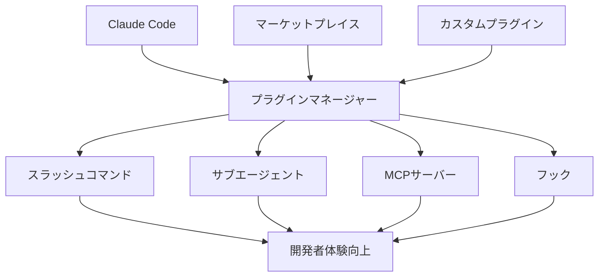

# 🔌 Claude Code プラグイン完全活用ガイド

> **最新情報**: Claude Codeプラグイン機能（パブリックベータ版）  
> **対象**: 開発チーム・個人開発者向け  
> **更新**: 2025年10月22日

---

## 📖 目次

1. [プラグイン機能概要](#1-プラグイン機能概要)
2. [プラグイン構成要素詳解](#2-プラグイン構成要素詳解)
3. [マーケットプレイス活用法](#3-マーケットプレイス活用法)
4. [プラグイン導入・管理](#4-プラグイン導入管理)
5. [チーム開発での活用](#5-チーム開発での活用)
6. [プラグイン作成ガイド](#6-プラグイン作成ガイド)
7. [実践的活用事例](#7-実践的活用事例)

---

## 1. プラグイン機能概要

### 🎯 プラグインとは

Claude Codeのプラグインは、開発効率化のための**4つの要素を統合したツールキット**です。

```
🔌 プラグイン = 開発ツールキット
├── 📝 スラッシュコマンド (/)
├── 🤖 サブエージェント
├── 🔗 MCPサーバー
└── ⚡ フック
```

### 🌟 従来の問題点と解決策

#### ❌ Before（従来）
```
個別設定の課題:
├── 😫 セットアップが複雑・時間がかかる
├── 🔄 チーム間での設定共有が困難
├── 📚 設定方法のドキュメント化・維持が大変
├── 🐛 環境差異によるエラー発生
└── 🔧 新メンバーのオンボーディングに時間
```

#### ✅ After（プラグイン化）
```
統合ソリューション:
├── 🚀 ワンクリックでセットアップ完了
├── 📦 チーム全体で同じ環境を瞬時に共有
├── 📋 プラグインが設定方法を包含
├── 🎯 標準化された環境で一貫性確保
└── ⚡ 新メンバーも即座に戦力化
```

### 🏗️ プラグインのアーキテクチャ



---

## 2. プラグイン構成要素詳解

### 📝 スラッシュコマンド (/)

#### 概要
頻繁に使う操作を短いコマンドで実行できるカスタムショートカット

#### 実際の使用例
```bash
# テスト関連
/test_all              # 全テスト実行
/test_unit             # ユニットテストのみ
/test_e2e              # E2Eテストのみ
/test_coverage         # カバレッジ付きテスト

# ビルド・デプロイ関連
/build_prod            # 本番ビルド
/deploy_staging        # ステージング環境デプロイ
/deploy_prod           # 本番環境デプロイ

# コード品質関連
/lint_fix              # リント問題の自動修正
/format_all            # コード整形
/type_check            # TypeScript型チェック

# Git操作関連
/git_clean             # ブランチクリーンアップ
/git_rebase            # インタラクティブリベース
/git_squash            # コミット統合

# プロジェクト固有
/generate_api_docs     # API仕様書生成
/update_dependencies   # 依存関係更新
/backup_db             # データベースバックアップ
```

#### カスタムコマンド作成例
```json
// .claude-plugin/commands.json
{
  "commands": [
    {
      "name": "test_all",
      "description": "Run all tests with coverage",
      "script": "npm run test -- --coverage --watchAll=false",
      "category": "testing"
    },
    {
      "name": "deploy_staging",
      "description": "Deploy to staging environment",
      "script": "npm run build && aws s3 sync dist/ s3://my-app-staging",
      "category": "deployment",
      "confirmationRequired": true
    }
  ]
}
```

### 🤖 サブエージェント

#### 概要
特定の開発タスクに特化した専門AIエージェント

#### 専門エージェントの種類
```
🤖 サブエージェント カタログ
├── 📚 ドキュメント生成エージェント
│   ├── README自動生成
│   ├── API仕様書作成
│   └── コメント最適化
├── 🐛 デバッグエージェント
│   ├── エラーログ分析
│   ├── パフォーマンス問題特定
│   └── セキュリティ脆弱性検出
├── 🧪 テストエージェント
│   ├── テストケース生成
│   ├── モック作成
│   └── テスト戦略提案
├── 🎨 UIエージェント
│   ├── アクセシビリティチェック
│   ├── レスポンシブ対応
│   └── デザインシステム適用
└── 🔧 リファクタリングエージェント
    ├── コード最適化
    ├── 技術的負債解消
    └── パターン適用
```

#### エージェント呼び出し例
```typescript
// プラグイン内でのエージェント定義
export const documentationAgent = {
  name: "documentation",
  description: "Generate comprehensive documentation",
  systemPrompt: `
    あなたは技術ドキュメント作成の専門家です。
    以下の基準で高品質なドキュメントを生成してください：
    
    1. 読みやすさ：明確で簡潔な表現
    2. 完全性：必要な情報を漏れなく記載
    3. 保守性：更新しやすい構造
    4. アクセシビリティ：初心者にも理解可能
  `,
  tools: ["file_reader", "code_analyzer", "markdown_generator"]
};

// 使用例
// Claude Code内で: @documentation "このAPIの仕様書を作成して"
```

### 🔗 MCPサーバー (Model Context Protocol)

#### 概要
外部のデータソースやツールとClaude Codeを連携させるプロトコル

#### MCP活用例
```
🔗 MCP統合例
├── 📊 データベース連携
│   ├── PostgreSQL クエリ実行
│   ├── MongoDB データ取得
│   └── Redis キャッシュ操作
├── 🌐 API統合
│   ├── REST API呼び出し
│   ├── GraphQL クエリ
│   └── WebSocket通信
├── ☁️ クラウドサービス
│   ├── AWS S3 ファイル操作
│   ├── GCP BigQuery データ分析
│   └── Azure Functions 実行
├── 🔧 開発ツール
│   ├── Docker コンテナ管理
│   ├── Kubernetes デプロイ
│   └── CI/CD パイプライン操作
└── 📁 ファイルシステム
    ├── ローカルファイル操作
    ├── FTPサーバー接続
    └── Git リポジトリ操作
```

#### MCPサーバー実装例
```typescript
// mcp-server/database.ts
import { MCPServer } from '@claude/mcp';

export class DatabaseMCPServer extends MCPServer {
  constructor() {
    super({
      name: "database",
      version: "1.0.0",
      description: "Database operations for development"
    });
  }

  async executeQuery(query: string): Promise<any[]> {
    // データベースクエリ実行ロジック
    const results = await this.db.query(query);
    return results;
  }

  async getTableSchema(tableName: string): Promise<object> {
    // テーブルスキーマ取得ロジック
    const schema = await this.db.getSchema(tableName);
    return schema;
  }

  // Claude Codeから呼び出し可能なメソッドを定義
  tools = {
    execute_query: this.executeQuery,
    get_schema: this.getTableSchema
  };
}
```

### ⚡ フック

#### 概要
開発ワークフローの特定タイミングで自動実行される処理

#### フックの種類
```
⚡ フック トリガーポイント
├── 📝 コード編集時
│   ├── ファイル保存時
│   ├── コード変更検知時
│   └── 特定パターン入力時
├── 🔄 Git操作時
│   ├── コミット前
│   ├── プッシュ前
│   └── マージ前
├── 🧪 テスト実行時
│   ├── テスト開始前
│   ├── テスト完了後
│   └── テスト失敗時
├── 🚀 デプロイ時
│   ├── ビルド開始前
│   ├── デプロイ完了後
│   └── デプロイ失敗時
└── 🤖 AI操作時
    ├── コード生成後
    ├── レビュー完了後
    └── 質問投稿時
```

#### フック実装例
```json
// .claude-plugin/hooks.json
{
  "hooks": [
    {
      "name": "pre-commit-quality-check",
      "trigger": "git.pre-commit",
      "script": "./scripts/quality-check.sh",
      "description": "Run code quality checks before commit"
    },
    {
      "name": "post-test-coverage-report",
      "trigger": "test.completed",
      "script": "npm run coverage:report",
      "condition": "test.success === true"
    },
    {
      "name": "ai-code-review",
      "trigger": "code.generated",
      "agent": "code-reviewer",
      "description": "Automatic code review after AI generation"
    }
  ]
}
```

---

## 3. マーケットプレイス活用法

### 🏪 マーケットプレイスとは

開発者が作成したプラグインを集めた「ストア」のような仕組み

```
🏪 マーケットプレイス構造
├── 🏢 公式マーケットプレイス (Anthropic)
├── 🏛️ 企業・組織専用マーケットプレイス
├── 👥 コミュニティマーケットプレイス
└── 🔒 プライベートマーケットプレイス
```

### 📦 人気プラグインカテゴリ

#### 🌐 フレームワーク特化プラグイン
```
React開発プラグイン:
├── /create-component     # コンポーネント雛形生成
├── /optimize-bundle      # バンドルサイズ最適化
├── /add-storybook        # Storybook設定追加
└── /test-component       # コンポーネントテスト生成

Next.js開発プラグイン:
├── /create-api-route     # APIルート生成
├── /optimize-images      # 画像最適化
├── /setup-auth           # 認証機能セットアップ
└── /deploy-vercel        # Vercelデプロイ

Vue.js開発プラグイン:
├── /create-vue-component # Vueコンポーネント生成
├── /setup-pinia          # Pinia状態管理セットアップ
├── /add-composable       # Composable作成
└── /optimize-vite        # Vite設定最適化
```

#### 🎯 言語・技術特化プラグイン
```
TypeScript開発プラグイン:
├── /type-generator       # 型定義自動生成
├── /strict-config        # 厳密設定適用
├── /migration-assistant  # JS→TS移行支援
└── /type-checker         # 高度な型チェック

Python開発プラグイン:
├── /fastapi-generator    # FastAPI雛形生成
├── /pytest-setup         # pytest環境構築
├── /poetry-manager       # Poetry依存関係管理
└── /type-hints-generator # 型ヒント自動追加

Rust開発プラグイン:
├── /cargo-helper         # Cargoコマンド支援
├── /error-analyzer       # エラー分析・修正提案
├── /performance-profiler # パフォーマンス分析
└── /unsafe-checker       # unsafeコード検証
```

#### 🏢 企業・チーム向けプラグイン
```
品質管理プラグイン:
├── /code-review-standards # コードレビュー基準適用
├── /security-scanner      # セキュリティスキャン
├── /performance-monitor   # パフォーマンス監視
└── /compliance-checker    # コンプライアンス確認

開発プロセスプラグイン:
├── /agile-workflow       # アジャイル開発支援
├── /documentation-sync   # ドキュメント同期
├── /issue-tracker        # 課題管理連携
└── /deployment-pipeline  # デプロイパイプライン
```

### 🔍 プラグイン検索・選定

#### 選定基準
```
📋 プラグイン評価チェックリスト
├── ⭐ 評価・レビュー数
├── 📅 最終更新日（メンテナンス状況）
├── 📚 ドキュメントの充実度
├── 🐛 既知の問題・制限事項
├── 🔒 セキュリティ面の考慮
├── ⚡ パフォーマンス影響
├── 🔄 既存ツールとの互換性
└── 👥 開発者・組織の信頼性
```

---

## 4. プラグイン導入・管理

### 🚀 プラグイン導入手順

#### Step 1: マーケットプレイス追加
```bash
# 公式マーケットプレイス
/plugin marketplace add anthropics/claude-code

# コミュニティマーケットプレイス
/plugin marketplace add community/awesome-plugins

# 企業専用マーケットプレイス
/plugin marketplace add your-company/internal-plugins

# プライベートリポジトリ（認証付き）
/plugin marketplace add github:your-org/private-plugins --token=ghp_xxx
```

#### Step 2: プラグイン検索・インストール
```bash
# プラグイン一覧表示
/plugin list

# カテゴリで絞り込み
/plugin list --category=testing

# キーワード検索
/plugin search "react component"

# 特定プラグインの詳細確認
/plugin info react-dev-toolkit

# プラグインインストール
/plugin install react-dev-toolkit

# 複数プラグイン一括インストール
/plugin install react-dev-toolkit typescript-helper testing-suite
```

#### Step 3: プラグイン設定・管理
```bash
# インストール済みプラグイン確認
/plugin status

# プラグイン有効化・無効化
/plugin enable react-dev-toolkit
/plugin disable typescript-helper

# プラグイン設定変更
/plugin config react-dev-toolkit

# プラグイン更新
/plugin update react-dev-toolkit
/plugin update --all

# プラグインアンインストール
/plugin uninstall react-dev-toolkit
```

### ⚙️ プラグイン管理のベストプラクティス

#### プロジェクト単位での管理
```json
// .claude-plugins/project.json
{
  "plugins": {
    "required": [
      "typescript-helper@^1.2.0",
      "testing-suite@^2.1.0",
      "code-quality@^1.5.0"
    ],
    "optional": [
      "ai-code-reviewer@^1.0.0",
      "performance-analyzer@^2.0.0"
    ],
    "development": [
      "debug-assistant@^1.1.0",
      "mock-generator@^1.3.0"
    ]
  },
  "settings": {
    "auto-enable": ["typescript-helper", "testing-suite"],
    "auto-disable": ["performance-analyzer"],
    "update-policy": "patch"
  }
}
```

#### チーム共有設定
```bash
# チーム設定をGitで管理
git add .claude-plugins/
git commit -m "Add team plugin configuration"

# 新メンバーの環境セットアップ
/plugin install --from-project
# または
/plugin sync --team-config
```

---

## 5. チーム開発での活用

### 👥 チーム標準化戦略

#### 開発プロセス統一
```
🏢 企業・チーム活用パターン
├── 📏 コーディング標準の統一
│   ├── ESLint/Prettier設定の共有
│   ├── コミット規約の徹底
│   └── コードレビュー基準の適用
├── 🧪 テスト品質の保証
│   ├── テストカバレッジ基準
│   ├── 必須テストパターン
│   └── 品質ゲートの設定
├── 🚀 デプロイプロセスの標準化
│   ├── 環境別デプロイ手順
│   ├── 承認フローの実装
│   └── 自動化スクリプト共有
└── 📚 ドキュメント規約の統一
    ├── API仕様書フォーマット
    ├── README構成の統一
    └── 変更履歴の記録方法
```

#### 実装例：チーム標準プラグイン
```json
// team-standards-plugin/plugin.json
{
  "name": "team-standards",
  "version": "1.0.0",
  "description": "Our team's development standards and workflows",
  "commands": [
    {
      "name": "setup_project",
      "script": "./scripts/setup-new-project.sh",
      "description": "Setup new project with team standards"
    },
    {
      "name": "check_quality",
      "script": "./scripts/quality-gate.sh",
      "description": "Run comprehensive quality checks"
    }
  ],
  "hooks": [
    {
      "name": "enforce-commit-convention",
      "trigger": "git.pre-commit",
      "script": "./scripts/check-commit-message.sh"
    },
    {
      "name": "require-tests",
      "trigger": "git.pre-push",
      "script": "./scripts/ensure-test-coverage.sh"
    }
  ],
  "agents": [
    {
      "name": "code-reviewer",
      "description": "Apply team code review standards",
      "systemPrompt": "./prompts/code-review-standards.md"
    }
  ]
}
```

### 🎓 新人教育・オンボーディング

#### 段階的学習プラグイン
```
🎓 学習段階別プラグイン
├── 📚 基礎学習フェーズ
│   ├── /learn_basics      # 基本概念説明
│   ├── /practice_coding   # 練習問題生成
│   └── /check_understanding # 理解度チェック
├── 🛠️ 実践フェーズ
│   ├── /guided_implementation # ガイド付き実装
│   ├── /best_practices       # ベストプラクティス提示
│   └── /code_review_training # レビュー能力向上
└── 🚀 応用フェーズ
    ├── /architecture_design  # 設計スキル向上
    ├── /performance_optimization # 最適化手法
    └── /leadership_skills     # リーダーシップ開発
```

---

## 6. プラグイン作成ガイド

### 📝 プラグイン作成の基本

#### プロジェクト構造
```
my-awesome-plugin/
├── 📄 plugin.json          # プラグイン設定ファイル
├── 📁 commands/             # スラッシュコマンド
│   ├── test-runner.js
│   └── deploy.js
├── 📁 agents/               # サブエージェント
│   ├── code-reviewer.js
│   └── doc-generator.js
├── 📁 mcp-servers/          # MCPサーバー
│   ├── database.js
│   └── api-client.js
├── 📁 hooks/                # フック
│   ├── pre-commit.js
│   └── post-deploy.js
├── 📁 scripts/              # 実行スクリプト
├── 📁 prompts/              # エージェント用プロンプト
├── 📄 README.md             # プラグイン説明
└── 📄 package.json          # 依存関係
```

#### plugin.json 基本設定
```json
{
  "name": "my-awesome-plugin",
  "version": "1.0.0",
  "description": "An awesome plugin for development productivity",
  "author": "Your Name <your.email@example.com>",
  "license": "MIT",
  "keywords": ["productivity", "automation", "development"],
  "repository": "https://github.com/username/my-awesome-plugin",
  
  "commands": [
    {
      "name": "awesome_command",
      "description": "Run awesome command",
      "script": "./commands/awesome.js",
      "category": "utility"
    }
  ],
  
  "agents": [
    {
      "name": "awesome-agent",
      "description": "Awesome AI agent",
      "entry": "./agents/awesome-agent.js"
    }
  ],
  
  "mcpServers": [
    {
      "name": "awesome-mcp",
      "description": "Awesome MCP server",
      "entry": "./mcp-servers/awesome.js"
    }
  ],
  
  "hooks": [
    {
      "name": "awesome-hook",
      "trigger": "git.pre-commit",
      "script": "./hooks/pre-commit.js"
    }
  ],
  
  "dependencies": {
    "axios": "^1.0.0",
    "lodash": "^4.17.21"
  },
  
  "settings": {
    "configurable": {
      "api_endpoint": {
        "type": "string",
        "default": "https://api.example.com",
        "description": "API endpoint URL"
      },
      "enable_notifications": {
        "type": "boolean", 
        "default": true,
        "description": "Enable notifications"
      }
    }
  }
}
```

### 🛠️ 実装例

#### スラッシュコマンド実装
```javascript
// commands/test-runner.js
const { exec } = require('child_process');
const { promisify } = require('util');

const execAsync = promisify(exec);

module.exports = {
  name: 'test_all',
  description: 'Run all tests with coverage',
  
  async execute(args, context) {
    try {
      // 進捗表示
      context.showProgress('Running tests...');
      
      // テスト実行
      const { stdout, stderr } = await execAsync('npm test -- --coverage');
      
      // 結果表示
      context.showResult({
        success: true,
        output: stdout,
        summary: 'All tests passed successfully!'
      });
      
    } catch (error) {
      context.showResult({
        success: false,
        error: error.message,
        summary: 'Some tests failed'
      });
    }
  },
  
  // 引数定義
  arguments: [
    {
      name: 'filter',
      type: 'string',
      optional: true,
      description: 'Test file filter pattern'
    }
  ]
};
```

#### サブエージェント実装
```javascript
// agents/code-reviewer.js
module.exports = {
  name: 'code-reviewer',
  description: 'AI code reviewer specialized in our coding standards',
  
  systemPrompt: `
あなたは経験豊富なソフトウェアエンジニアです。
以下の観点でコードレビューを行ってください：

1. コード品質
   - 可読性・保守性
   - パフォーマンス
   - セキュリティ

2. チーム規約
   - 命名規則の遵守
   - アーキテクチャパターンの適用
   - テストカバレッジ

3. ベストプラクティス
   - SOLID原則
   - DRY原則
   - エラーハンドリング

具体的な改善案を提示してください。
  `,
  
  async processMessage(message, context) {
    // コードレビューロジック
    const codeAnalysis = await this.analyzeCode(message.code);
    const suggestions = await this.generateSuggestions(codeAnalysis);
    
    return {
      review: suggestions,
      severity: this.calculateSeverity(suggestions),
      actionItems: this.extractActionItems(suggestions)
    };
  },
  
  tools: ['code_analyzer', 'pattern_detector', 'security_scanner']
};
```

#### MCPサーバー実装
```javascript
// mcp-servers/project-database.js
const { MCPServer } = require('@claude/mcp');
const { DatabaseClient } = require('./database-client');

class ProjectDatabaseMCP extends MCPServer {
  constructor() {
    super({
      name: 'project-database',
      version: '1.0.0',
      description: 'Access project database for development tasks'
    });
    
    this.db = new DatabaseClient(process.env.DATABASE_URL);
  }
  
  // Claude Codeから呼び出せるツール定義
  tools = {
    query_users: async (filters) => {
      return await this.db.users.findMany({
        where: filters,
        select: { id: true, name: true, email: true }
      });
    },
    
    get_table_schema: async (tableName) => {
      return await this.db.introspection.getTableSchema(tableName);
    },
    
    execute_safe_query: async (query) => {
      // 安全なクエリのみ実行（SELECTのみ等）
      if (!this.isSafeQuery(query)) {
        throw new Error('Only safe queries are allowed');
      }
      return await this.db.raw(query);
    }
  };
  
  isSafeQuery(query) {
    const normalizedQuery = query.trim().toLowerCase();
    return normalizedQuery.startsWith('select') && 
           !normalizedQuery.includes('drop') &&
           !normalizedQuery.includes('delete') &&
           !normalizedQuery.includes('update');
  }
}

module.exports = ProjectDatabaseMCP;
```

### 📦 プラグイン公開

#### マーケットプレイス用設定
```json
// .claude-plugin/marketplace.json
{
  "name": "Awesome Development Plugins",
  "description": "A collection of productivity plugins for developers",
  "version": "1.0.0",
  "plugins": [
    {
      "name": "my-awesome-plugin",
      "version": "1.0.0",
      "description": "Boost your development productivity",
      "path": "./my-awesome-plugin",
      "tags": ["productivity", "automation", "testing"],
      "author": "Your Name",
      "license": "MIT",
      "downloads": 1250,
      "rating": 4.8,
      "lastUpdated": "2025-10-20"
    }
  ],
  "categories": [
    {
      "name": "Productivity",
      "plugins": ["my-awesome-plugin"]
    }
  ]
}
```

#### GitHub Actions でのCI/CD
```yaml
# .github/workflows/plugin-ci.yml
name: Plugin CI/CD

on:
  push:
    branches: [main]
  pull_request:
    branches: [main]

jobs:
  test:
    runs-on: ubuntu-latest
    steps:
      - uses: actions/checkout@v3
      
      - name: Setup Node.js
        uses: actions/setup-node@v3
        with:
          node-version: '18'
          
      - name: Install dependencies
        run: npm ci
        
      - name: Run tests
        run: npm test
        
      - name: Validate plugin configuration
        run: npx claude-plugin validate
        
  publish:
    needs: test
    runs-on: ubuntu-latest
    if: github.ref == 'refs/heads/main'
    steps:
      - uses: actions/checkout@v3
      
      - name: Publish to marketplace
        run: npx claude-plugin publish
        env:
          CLAUDE_API_KEY: ${{ secrets.CLAUDE_API_KEY }}
```

---

## 7. 実践的活用事例

### 🎯 note記事自動生成エージェント での活用

#### プロジェクト専用プラグイン
```json
// note-agent-plugin/plugin.json
{
  "name": "note-agent-plugin",
  "version": "1.0.0",
  "description": "Plugin for note article generation agent development",
  
  "commands": [
    {
      "name": "test_generation",
      "description": "Test article generation with sample data",
      "script": "./commands/test-generation.js"
    },
    {
      "name": "deploy_staging",
      "description": "Deploy to staging environment",
      "script": "./commands/deploy-staging.js"
    },
    {
      "name": "analyze_performance",
      "description": "Analyze generation performance",
      "script": "./commands/analyze-performance.js"
    }
  ],
  
  "agents": [
    {
      "name": "article-optimizer",
      "description": "Optimize generated articles for SEO and readability",
      "entry": "./agents/article-optimizer.js"
    },
    {
      "name": "prompt-engineer",
      "description": "Improve AI prompts for better generation quality",
      "entry": "./agents/prompt-engineer.js"
    }
  ],
  
  "mcpServers": [
    {
      "name": "gemini-api",
      "description": "Gemini API integration for article generation",
      "entry": "./mcp-servers/gemini-api.js"
    },
    {
      "name": "supabase-db",
      "description": "Supabase database integration",
      "entry": "./mcp-servers/supabase-db.js"
    }
  ],
  
  "hooks": [
    {
      "name": "validate-generated-content",
      "trigger": "ai.content-generated",
      "script": "./hooks/validate-content.js"
    },
    {
      "name": "update-performance-metrics",
      "trigger": "test.completed", 
      "script": "./hooks/update-metrics.js"
    }
  ]
}
```

#### 実装例：記事最適化エージェント
```javascript
// agents/article-optimizer.js
module.exports = {
  name: 'article-optimizer',
  description: 'Optimize note articles for SEO and readability',
  
  systemPrompt: `
あなたはnoteプラットフォームに特化した記事最適化の専門家です。
以下の観点で記事を分析・改善してください：

1. SEO最適化
   - タイトルの魅力度（32文字以内）
   - メタディスクリプション（120文字以内）
   - キーワード密度の適正化
   - 見出し構造の最適化

2. 読みやすさ向上
   - 段落の長さ調整
   - 箇条書きの効果的使用
   - 漢字・ひらがなバランス
   - 改行・空白の適切な配置

3. note特有の最適化
   - ハッシュタグの効果的使用
   - 読者との距離感
   - 共感を呼ぶ表現
   - 行動喚起の配置

具体的な改善案を提示してください。
  `,
  
  async optimizeArticle(article, context) {
    const analysis = {
      seoScore: await this.calculateSEOScore(article),
      readabilityScore: await this.calculateReadabilityScore(article),
      noteOptimization: await this.analyzeNoteOptimization(article)
    };
    
    const suggestions = await this.generateOptimizationSuggestions(analysis);
    
    return {
      originalScore: analysis,
      suggestions: suggestions,
      optimizedVersion: await this.applyOptimizations(article, suggestions)
    };
  }
};
```

### 🏢 企業・チーム活用事例

#### 品質管理統合プラグイン
```javascript
// enterprise-quality-plugin/commands/quality-gate.js
module.exports = {
  name: 'quality_gate',
  description: 'Run comprehensive quality checks',
  
  async execute(args, context) {
    const checks = [
      { name: 'TypeScript', command: 'npm run type-check' },
      { name: 'ESLint', command: 'npm run lint' },
      { name: 'Tests', command: 'npm run test' },
      { name: 'Security', command: 'npm audit' },
      { name: 'Bundle Size', command: 'npm run analyze' }
    ];
    
    const results = [];
    
    for (const check of checks) {
      context.showProgress(`Running ${check.name}...`);
      
      try {
        const result = await execAsync(check.command);
        results.push({
          name: check.name,
          status: 'passed',
          output: result.stdout
        });
      } catch (error) {
        results.push({
          name: check.name,
          status: 'failed',
          error: error.message
        });
      }
    }
    
    const passedCount = results.filter(r => r.status === 'passed').length;
    const totalCount = results.length;
    
    context.showResult({
      success: passedCount === totalCount,
      summary: `Quality Gate: ${passedCount}/${totalCount} checks passed`,
      details: results
    });
  }
};
```

---

## 🎯 まとめ・次のステップ

### 📋 プラグイン活用チェックリスト

#### 個人開発者向け
- [ ] 公式マーケットプレイス追加
- [ ] 使用技術に特化したプラグイン導入
- [ ] 日常作業の自動化コマンド設定
- [ ] 個人用カスタムプラグイン作成

#### チーム開発向け
- [ ] チーム標準プラグインの導入
- [ ] 品質管理フックの設定
- [ ] 新人オンボーディング用プラグイン準備
- [ ] プライベートマーケットプレイス構築

#### 企業・組織向け
- [ ] セキュリティ・コンプライアンス対応プラグイン
- [ ] 開発プロセス統一プラグイン
- [ ] パフォーマンス・品質監視プラグイン
- [ ] レガシーシステム統合MCPサーバー

### 🚀 今後の展望

```
プラグインエコシステムの発展予想:
├── 📈 2025年Q1-Q2
│   ├── 主要フレームワーク公式プラグイン登場
│   ├──企業向け統合プラグインの充実
│   └── AI生成プラグインの実用化
├── 🌐 2025年Q3-Q4
│   ├── クロスプラットフォーム統合
│   ├── リアルタイム協調機能
│   └── セキュリティ・監査機能強化
└── 🔮 2026年以降
    ├── 完全自動化ワークフロー
    ├── AI駆動プラグイン開発
    └── 業界標準プロトコル確立
```

**🔌 Claude Codeプラグインで開発効率を次のレベルへ！**

### 📞 サポート・コミュニティ
- **公式ドキュメント**: プラグイン開発ガイド
- **GitHub**: オープンソースプラグイン・事例集
- **Discord**: プラグイン開発者コミュニティ
- **勉強会**: 実践的活用法・最新情報共有

---

*🤖 このプラグインガイドもClaude Codeを活用して作成されました*