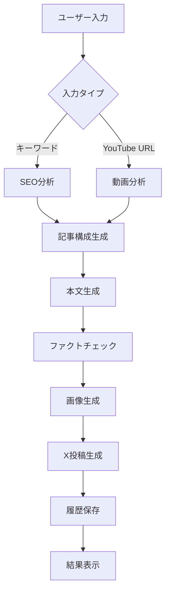

# note記事自動生成エージェント - 技術仕様書

**バージョン**: 1.5.1  
**最終更新**: 2025年10月17日  
**対象読者**: 開発者・システム管理者・技術担当者

---

## 📋 システム概要

### プロダクト名
**note記事自動生成エージェント** (Note Article Generation Agent)

### 概要
Google Gemini AIを活用した、SEO最適化記事の自動生成システム。統合リサーチ機能、画像生成、SNS投稿作成までの一気通貫ワークフローを提供。

### アーキテクチャ
- **フロントエンド**: Next.js 15.5.5 (App Router)
- **AIエンジン**: Google Gemini 2.5 Flash/Pro
- **言語**: TypeScript 5.8 + React 19
- **UI**: Tailwind CSS + カスタムコンポーネント
- **データベース**: Supabase (PostgreSQL) + LocalStorage fallback
- **認証**: Supabase Auth (Google/Email)
- **デプロイ**: Vercel

---

## 🛠 技術スタック

### フロントエンド技術
```json
{
  "framework": "Next.js 15.5.5",
  "runtime": "React 19",
  "language": "TypeScript 5.8",
  "styling": "Tailwind CSS 3.4",
  "bundler": "Webpack 5 (Next.js内蔵)",
  "linting": "ESLint 8.57.1",
  "package_manager": "npm"
}
```

### AI/外部API
- **Google Gemini AI**: テキスト生成・画像生成
- **Google Search API**: SERP分析 (オプション)
- **Tavily API**: ファクトチェック (オプション)
- **Supabase**: データベース・認証 (オプション)
- **Web Speech API**: 音声入力
- **X (Twitter) API**: SNS投稿 (計画中)

### 開発ツール
- **Vite**: 開発サーバー（高速HMR）
- **Mermaid.js**: 図解生成
- **Playwright**: E2Eテスト・自動投稿
- **GitHub Actions**: CI/CD
- **Vercel**: デプロイメント

---

## 🏗 システムアーキテクチャ

### ディレクトリ構造
```
note-agent/
├── src/
│   ├── app/                    # Next.js App Router
│   │   ├── page.tsx           # メインページ
│   │   ├── layout.tsx         # ルートレイアウト
│   │   └── globals.css        # グローバルスタイル
│   ├── components/            # Reactコンポーネント
│   │   ├── forms/            # フォーム関連
│   │   ├── display/          # 表示コンポーネント
│   │   ├── feedback/         # フィードバック・進捗表示
│   │   ├── audio/            # 音声入力
│   │   ├── collaboration/    # コラボレーション機能
│   │   ├── abtest/          # A/Bテスト機能
│   │   └── providers/       # Context Provider
│   ├── services/             # ビジネスロジック
│   │   ├── ai/              # AI関連サービス
│   │   ├── database/        # データベース操作
│   │   ├── research/        # リサーチ機能
│   │   ├── social/          # SNS連携
│   │   └── collaboration/   # コラボレーション
│   ├── types/               # TypeScript型定義
│   ├── config/              # 設定ファイル
│   ├── utils/               # ユーティリティ関数
│   └── hooks/               # カスタムReactフック
├── docs/                    # ドキュメント
├── public/                  # 静的ファイル
└── tests/                   # テストファイル
```

### コンポーネント設計

#### コアコンポーネント
```typescript
// メインアプリケーション
app/page.tsx              # メインページ (Next.js App Router)
components/forms/InputGroup.tsx           # 統合入力フォーム
components/feedback/StepIndicator.tsx     # 進捗表示
components/display/OutputDisplay.tsx      # 結果表示
```

#### 機能別コンポーネント
```typescript
// 音声入力
components/audio/VoiceIdeaProcessor.tsx   # 音声アイデア処理

// A/Bテスト
components/abtest/ABTestPanel.tsx         # A/Bテスト設定
components/abtest/ABTestResultDisplay.tsx # 結果比較表示

// コラボレーション
components/collaboration/CollaborationSidebar.tsx  # サイドバー
components/collaboration/CommentThread.tsx         # コメント機能
components/collaboration/VersionHistory.tsx        # バージョン管理
```

---

## 🔄 データフロー

### 記事生成ワークフロー


### APIコール順序
1. **分析フェーズ**: `analyzeSerpResults()` または `transcribeYouTubeVideo()`
2. **構成フェーズ**: `createArticleOutline()`
3. **執筆フェーズ**: `writeArticle()`
4. **検証フェーズ**: `extractClaims()` → `performFactCheck()`
5. **画像フェーズ**: `createImagePrompt()` → `generateImage()`
6. **SNSフェーズ**: `generateXPosts()`
7. **保存フェーズ**: `saveToHistory()`

---

## 🔧 AIサービス仕様

### Gemini AI設定
```typescript
// モデル設定
const MODELS = {
    fast: 'gemini-2.5-flash',      // 高速処理用
    balanced: 'gemini-2.5-flash',  // バランス型
    quality: 'gemini-2.5-pro'      // 高品質用（将来実装）
};

// パフォーマンス設定
const RETRY_CONFIG = {
    maxRetries: 3,
    baseDelay: 2000,
    maxDelay: 60000,
    rateLimitDelay: 30000
};
```

### プロンプト設計原則
1. **構造化出力**: JSON Schema準拠
2. **コンテキスト制限**: 各プロンプト2,000文字以内
3. **反AI文体**: 自然な日本語表現を強制
4. **体験談挿入**: パーソナルエピソード必須

### レスポンス処理
```typescript
// JSON抽出ヘルパー
function extractJsonFromResponse(text: string): string {
    // ```json ブロック除去
    // { } 境界検出
    // マークダウン記法対応
}

// エラーハンドリング
try {
    const response = await geminiAPI.generateContent(prompt);
    const cleanJson = extractJsonFromResponse(response.text);
    return JSON.parse(cleanJson);
} catch (error) {
    // リトライ機構
    // フォールバック処理
    // ユーザー通知
}
```

---

## 📊 データモデル

### 記事データ構造
```typescript
interface ArticleOutline {
    title: string;              // SEOタイトル (32文字以内)
    metaDescription: string;    // メタディスクリプション (160文字以内)
    introduction: string;       // 導入文
    sections: Section[];        // セクション配列
    faq: FAQ[];                // FAQ配列
}

interface Section {
    heading: string;            // H2見出し
    content: string;           // セクション内容
}

interface FAQ {
    question: string;          // 質問
    answer: string;           // 回答
}
```

### X投稿データ構造
```typescript
interface XPostGenerationResult {
    shortPosts: XPost[];       // 短文投稿（5パターン）
    longPosts: XPost[];        // 長文投稿（2パターン）
    threads: XThread[];        // スレッド投稿（1-2パターン）
}

interface XPost {
    id: string;
    text: string;              // 投稿本文
    hashtags: string[];        // ハッシュタグ
    target: string;           // ターゲット層
    engagement: string;        // 予想エンゲージメント
}
```

### ファクトチェック構造
```typescript
interface FactCheckSummary {
    totalClaims: number;       // 総主張数
    verifiedClaims: number;    // 検証済み数
    incorrectClaims: number;   // 不正確数
    overallConfidence: 'high' | 'medium' | 'low';
    results: FactCheckResult[];
}

interface FactCheckResult {
    claim: string;             // 主張内容
    verdict: 'accurate' | 'inaccurate' | 'partially_accurate' | 'unverified';
    sources: FactCheckSource[];
    explanation: string;
}
```

---

## 🔒 セキュリティ仕様

### API認証
```typescript
// 環境変数管理
const REQUIRED_APIS = {
    NEXT_PUBLIC_GEMINI_API_KEY: '必須',
    NEXT_PUBLIC_GOOGLE_SEARCH_API_KEY: 'オプション',
    NEXT_PUBLIC_TAVILY_API_KEY: 'オプション',
    NEXT_PUBLIC_SUPABASE_URL: 'オプション',
    NEXT_PUBLIC_SUPABASE_ANON_KEY: 'オプション'
};

// バリデーション
function validateEnvironment() {
    const missingKeys = Object.entries(REQUIRED_APIS)
        .filter(([key, required]) => required === '必須' && !process.env[key])
        .map(([key]) => key);
    
    if (missingKeys.length > 0) {
        throw new Error(`必須環境変数が設定されていません: ${missingKeys.join(', ')}`);
    }
}
```

### データ保護
- **API キー**: `.env.local` で管理、Git除外
- **ユーザーデータ**: Supabase Row Level Security
- **履歴データ**: ローカル暗号化オプション
- **通信**: HTTPS必須

### 入力検証
```typescript
// XSS対策
function sanitizeInput(input: string): string {
    return input
        .replace(/<script\b[^<]*(?:(?!<\/script>)<[^<]*)*<\/script>/gi, '')
        .replace(/javascript:/gi, '');
}

// インジェクション対策
function validateKeyword(keyword: string): boolean {
    const pattern = /^[a-zA-Z0-9\u3040-\u309F\u30A0-\u30FF\u4E00-\u9FAF\s\-]+$/;
    return pattern.test(keyword) && keyword.length <= 100;
}
```

---

## ⚡ パフォーマンス仕様

### 目標パフォーマンス
```
記事生成時間：
- 2,500文字: 30-45秒
- 5,000文字: 45-60秒
- 10,000文字: 60-90秒

バンドルサイズ：
- 初期読み込み: ~1.11MB
- コンポーネント遅延読み込み
- 画像最適化: WebP/AVIF対応

レスポンス性能：
- FCP (First Contentful Paint): <1.5s
- LCP (Largest Contentful Paint): <2.0s
- CLS (Cumulative Layout Shift): <0.1
```

### 最適化技術
```typescript
// 動的インポート
const VoiceIdeaProcessor = dynamic(
    () => import('@/components/audio/VoiceIdeaProcessor'),
    { ssr: false }
);

// メモ化
const memoizedComponent = React.memo(ExpensiveComponent);

// 状態最適化
const [state, setState] = useState(() => expensiveInitialization());
```

---

## 🧪 テスト仕様

### テスト戦略
```typescript
// 単体テスト
describe('GeminiService', () => {
    test('should generate article outline', async () => {
        const outline = await createArticleOutline(mockAnalysis, 'beginner', 'polite', 'test');
        expect(outline).toHaveProperty('title');
        expect(outline.sections).toBeInstanceOf(Array);
    });
});

// 統合テスト
describe('Article Generation Flow', () => {
    test('should complete full workflow', async () => {
        const result = await generateFullArticle({
            keyword: 'テストキーワード',
            tone: 'polite',
            audience: 'beginner'
        });
        expect(result).toHaveProperty('markdownContent');
        expect(result).toHaveProperty('xPosts');
    });
});

// E2Eテスト (Playwright)
test('User can generate article', async ({ page }) => {
    await page.goto('/');
    await page.fill('#keyword', 'テストキーワード');
    await page.click('[type="submit"]');
    await expect(page.locator('.output-display')).toBeVisible();
});
```

### テスト環境
- **単体**: Jest + React Testing Library
- **統合**: Jest + MSW (API Mock)
- **E2E**: Playwright
- **カバレッジ**: 目標80%以上

---

## 🚀 デプロイメント仕様

### Vercel設定
```json
{
  "framework": "nextjs",
  "buildCommand": "npm run build",
  "outputDirectory": ".next",
  "installCommand": "npm install",
  "devCommand": "npm run dev"
}
```

### 環境変数設定
```bash
# 必須
NEXT_PUBLIC_GEMINI_API_KEY=your_gemini_api_key

# オプション (機能拡張)
NEXT_PUBLIC_GOOGLE_SEARCH_API_KEY=your_search_api_key
NEXT_PUBLIC_SEARCH_ENGINE_ID=your_search_engine_id
NEXT_PUBLIC_TAVILY_API_KEY=your_tavily_api_key
NEXT_PUBLIC_SUPABASE_URL=your_supabase_url
NEXT_PUBLIC_SUPABASE_ANON_KEY=your_supabase_anon_key
```

### CI/CDパイプライン
```yaml
# .github/workflows/deploy.yml
name: Deploy to Vercel
on:
  push:
    branches: [main]
jobs:
  deploy:
    runs-on: ubuntu-latest
    steps:
      - uses: actions/checkout@v4
      - uses: actions/setup-node@v4
        with:
          node-version: '18'
      - run: npm install
      - run: npm run build
      - run: npm run test
      - uses: amondnet/vercel-action@v25
```

---

## 📈 監視・ログ仕様

### エラー監視
```typescript
// エラートラッキング
class ErrorTracker {
    static logError(error: Error, context: string) {
        console.error(`[${context}] ${error.message}`, {
            stack: error.stack,
            timestamp: new Date().toISOString(),
            userAgent: navigator.userAgent
        });
        
        // 本番環境: Sentry/LogRocket等に送信
        if (process.env.NODE_ENV === 'production') {
            // sendToErrorService(error, context);
        }
    }
}

// パフォーマンス監視
function measurePerformance<T>(operation: () => Promise<T>, operationName: string): Promise<T> {
    const start = performance.now();
    return operation().finally(() => {
        const duration = performance.now() - start;
        console.log(`[Performance] ${operationName}: ${duration.toFixed(2)}ms`);
    });
}
```

### ユーザー分析
```typescript
// 利用統計
interface UsageAnalytics {
    articleGenerated: number;
    averageLength: number;
    popularKeywords: string[];
    errorRate: number;
    averageGenerationTime: number;
}

// A/Bテスト結果
interface ABTestMetrics {
    variantA_conversionRate: number;
    variantB_conversionRate: number;
    statisticalSignificance: number;
    sampleSize: number;
}
```

---

## 🔮 技術ロードマップ

### Phase 2（外部API統合）
- **Supabase Database**: 記事履歴の永続化
- **X API v2**: 自動投稿機能
- **note API**: プラットフォーム連携
- **WordPress API**: 他プラットフォーム投稿

### Phase 3（AI強化）
- **GPT-4o**: 代替AIエンジン
- **Claude 3.5**: 複数AI比較
- **ローカルLLM**: Ollama統合
- **カスタムモデル**: ファインチューニング

### Phase 4（エンタープライズ）
- **マルチテナント**: 組織管理
- **API Gateway**: 外部システム連携
- **マイクロサービス**: スケーラビリティ向上
- **Kubernetes**: コンテナオーケストレーション

---

## 📚 関連ドキュメント

- [ユーザー取扱説明書](./user-manual.md)
- [API仕様書](./api-documentation.md)
- [トラブルシューティングガイド](./troubleshooting.md)
- [開発者ガイド](../CLAUDE.md)
- [プロジェクト状況](../PROJECT_STATUS.md)

---

**作成者**: Claude Code  
**バージョン管理**: Git (GitHub)  
**ライセンス**: MIT License  
**サポート**: [GitHub Issues](https://github.com/WadoTeamAI/note-agent/issues)